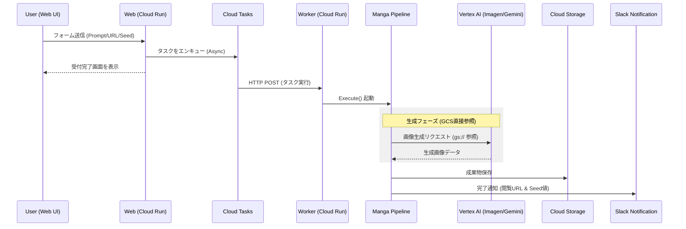

# ✍️ AP Manga Web

[](https://golang.org/)
[](https://golang.org/)
[](https://github.com/shouni/ap-manga-web/tags)
[](https://opensource.org/licenses/MIT)

## 🚀 概要 (About) - Webベースの画像生成オーケストレーター

**AP Manga Web** は、画像生成のコアライブラリ機能を **[Go Manga Kit](https://github.com/shouni/go-manga-kit)** を活用し、その機能を **Cloud Run** および **Google Cloud Tasks** を利用してWebアプリケーション化・オーケストレーションするためのプロジェクトです。

Webフォームを通じて画像生成処理を**非同期ワーカー**（Cloud Tasks）で実行します。処理完了時には **Slack** へ通知が飛び、生成された作品の確認や、キャラクター固定に必要な Seed 値の取得がスムーズに行えます。

---

## 🎨 5つのワークフロー (Workflows)

制作プロセスに応じて、以下の5つの機能をWeb UIから使い分けられます。

| 画面 (Command) | 役割 | 主な入力 / 出力 |
| --- | --- | --- |
| **Design** | DNA抽出。設定画を生成し、**固定用のSeed値を特定**する。 | キャラID / Design Image, **Final Seed** |
| **Generate** | 一括生成。台本解析から全パネルのパブリッシュまで一気通貫。 | URL・プロット / HTML, Images, MD |
| **Script** | 台本生成。URLやテキストからAIが物語構成案（JSON）を生成。 | URL・テキスト / JSON (Script) |
| **Panel** | パネル作画。既存の台本JSONから画像とHTMLを生成。 | 台本JSON / Images |
| **Page** | 生成済みのパネル画像を、Markdown形式に基づきページ単位にレイアウトし、ページ画像を生成 | Images |

---

## ✨ 技術スタック (Technology Stack)

| 要素 | 技術 / ライブラリ | 役割 |
| --- | --- | --- |
| **言語** | **Go (Golang)** | Webサーバー（API/タスクワーカー）の開発言語。 |
| **認証・セッション** | **`x/oauth2`** / **`gorilla/sessions`** | **Google OAuth 2.0** フローとセッション管理。 |
| **Webフレームワーク** | **go-chi/chi/v5** | 軽量なルーティング処理。 |
| **非同期実行** | **Google Cloud Tasks** | 重い画像生成処理をキューイング。 |
| **AIプラットフォーム** | **Vertex AI / Gemini API** | マルチモーダル生成。**GCSからの直接参照**をサポート。 |
| **結果保存** | **Google Cloud Storage (GCS)** | 生成物（HTML/画像）の永続化。 |
| **通知** | **Slack Webhook** | 生成完了および Seed 値の報告。 |

---

## 🏗 システムアーキテクチャ (System Architecture)

本プロジェクトは、**ヘキサゴナル・アーキテクチャ**と**サーバーレス・オーケストレーション**を組み合わせた設計を採用しています。

1. **Domain 層 (The Core)**
    * **システムの中心核**です。`Task` や `Notification` など、特定の技術（GCPやWeb）に依存しない純粋なデータ構造とビジネスルールを定義します。すべての層がこの共通言語を通じて連携する、アーキテクチャの真の中心です。
2. **Pipeline 層 (Orchestrator)**
    * **ワークフローの指揮官**としての役割を担います。Domain モデルを使用し、台本生成・画像生成・通知といった一連の処理プロセスを制御します。具体的な保存先や通知手段の詳細は持たず、抽象化されたインターフェース（Port）を介して命令を実行します。
3. **Server 層 (Entry Points)**
    * **外部システムとの窓口**であり、用途に応じて以下の2つの役割を持ちます。
        * **Web Handler**: ユーザーの入力を Domain モデルへ変換し、Cloud Tasks へジョブを投入します。
        * **Worker Handler**: Cloud Tasks からのリクエストを受け取り、Pipeline を起動する実行トリガーとして機能します。
4. **Adapters 層 (Infrastructure)**
    * **実務を担う手足**です。GCS、Slack、Gemini API、Cloud Tasks といった具体的な外部サービスと接続し、Pipeline からの抽象的な命令を現実の技術的な処理へと翻訳します。
5. **Builder 層 (Dependency Injection)**
    * **システムを組み立てる工場**です。アプリケーションの起動時に「Web用」または「Worker用」に必要な各パーツ（Adapters）を、Domain のルールに従って依存関係を注入しながら結合し、実行可能なシステムとして組み立てます。

---

## 🚀 使い方 (Usage) / セットアップ

### 1. 必要な環境変数

| 環境変数 | 説明 | デフォルト値 |
| --- | --- | --- |
| `SERVICE_URL` | アプリのルートURL（例: `https://myapp.run.app`） | `http://localhost:8080` |
| `GCP_PROJECT_ID` | Vertex AI / Cloud Tasks 等で使用するプロジェクトID | - |
| `GCP_LOCATION_ID` | 使用するリージョン（例: `asia-northeast1`） | `asia-northeast1` |
| `CLOUD_TASKS_QUEUE_ID` | 使用する Cloud Tasks のキュー名 | `manga-queue` |
| `SERVICE_ACCOUNT_EMAIL` | タスク発行に使用するサービスアカウント | - |
| `TASK_AUDIENCE_URL` | OIDCトークンの検証用URL | `SERVICE_URL` と同じ |
| `GCS_MANGA_BUCKET` | 画像とHTMLを保存するバケット名 | - |
| `GEMINI_API_KEY` | Google AI Studio 用のAPIキー（Vertex AI不使用時） | - |
| `GEMINI_MODEL` | 台本構成に使用するモデル名 | `gemini-3-flash-preview` |
| `IMAGE_MODEL` | 標準画像生成モデル（パネル用） | `gemini-3-pro-image-preview` |
| `IMAGE_QUALITY_MODEL` | 高品質画像生成モデル（ページ用） | `gemini-3-pro-image-preview` |
| `GOOGLE_CLIENT_ID` | OAuthクライアントID | - |
| `GOOGLE_CLIENT_SECRET` | OAuthクライアントシークレット | - |
| `SESSION_SECRET` | セッションデータのHMAC署名用シークレット | - |
| `SESSION_ENCRYPT_KEY` | セッションデータのAES暗号化用シークレット | - |
| `ALLOWED_EMAILS` | 許可するメールアドレス（カンマ区切り） | - |
| `ALLOWED_DOMAINS` | 許可するドメイン（例: `example.com`） | - |
| `SLACK_WEBHOOK_URL` | 通知を送る先の Slack Webhook URL | - |

---

## 🔐 必要なIAMロールの設定（重要）

本アプリケーションを Google Cloud Run と Cloud Tasks で安全に運用するためには、各サービスアカウント（SA）に対し、**正確な権限付与**が必要です。設定が不足していると `PermissionDenied (actAs)` や `403 Forbidden` エラーが発生します。

### A. Cloud Run 実行サービスアカウント

*Webフロントエンドおよび非同期ワーカーとして動作する、アプリケーションの主体となるサービスアカウントです。*

| 権限（IAMロール） | 目的 |
| :--- | :--- |
| **Cloud Tasks エンキューア** (`roles/cloudtasks.enqueuer`) | Webフォーム受付時に、タスクを Cloud Tasks キューに**追加**するために必要です。 |
| **サービス アカウント ユーザー** (`roles/iam.serviceAccountUser`) | **最重要:** Cloud Tasks にタスクを託す際、指定した SA として振る舞う（ActAs）ために必要です。**SA自身に対してこの権限を付与**する必要があります。 |
| **サービス アカウント トークン作成者** (`roles/iam.serviceAccountTokenCreator`) | OIDCトークンを生成し、安全なシステム間認証を行うために必要です。 |
| **Vertex AI ユーザー** (`roles/aiplatform.user`) | Vertex AI モデル（Gemini/Imagen）を呼び出すために必要です。 |
| **Cloud Run 起動元** (`roles/run.invoker`) | Cloud Tasks が自分自身（ワーカーエンドポイント）を認証付きで呼び出すことを許可するために必要です。 |
| **Storage オブジェクト管理者** (`roles/storage.objectAdmin`) | 生成された画像やHTMLファイルを **GCS** バケットに保存するために必要です。 |
| **Secret Manager のシークレット アクセサー** (`roles/secretmanager.secretAccessor`) | `GEMINI_API_KEY` や OAuth 情報を Secret Manager から安全に取得するために必要です。 |
| **ログ書き込み** (`roles/logging.logWriter`) | Cloud Logging へ動作ログを出力するために必要です。 |

### B. Cloud Tasks 用の設定（認証の紐付け）

Cloud Tasks がワーカーを呼び出す際に使用する ID（`ServiceAccountEmail`）に関する設定です。

| 項目 | 内容 |
| :--- | :--- |
| **対象エンドポイント** | `/tasks/generate` (POST) |
| **認証方式** | OIDC トークン認証 |
| **Audience** | アプリの `SERVICE_URL`（例: `https://...run.app`） |
| **実行主体** | `SERVICE_ACCOUNT_EMAIL` に設定したサービスアカウント |

---

## 🏗 プロジェクトレイアウト (Project Layout)

```text
ap-manga-web/
├── main.go        # エントリーポイント
├── internal/
│   ├── app/       # DIコンテナ定義。
│   ├── adapters/  # Slack, Gemini(Vertex AI/Google AI) 連携の実装
│   ├── builder/   # Factory層。Containerの構築を担当
│   ├── config/    # 環境変数、キャラクター定義等の管理
│   ├── domain/    # ビジネスドメインの型定義
│   ├── pipeline/  # 実行フロー制御。Workflowを組み合わせて一連の処理を実行
│   └── server/    # HTTP サーバー層。ルーティングおよびハンドラー
└── templates/     # UIテンプレート (HTML/Bootstrap 5)

```

---

## 💻 ワークフロー (Workflow)

1. **Request**: ユーザーが Web フォームからプロット等を送信。
2. **Enqueue**: `CloudTasksAdapter` を介してジョブを非同期投入。
3. **Worker**: `MangaPipeline` が起動。
4. **Pipeline**:
    * **Phase 1: Script/Page**: プロットのパースと構成。
    * **Phase 2: Panel/Design**: **Vertex AI + GCS 直接参照** による高速な画像生成。
    * **Phase 3: Publish**: 成果物をGCSに保存。
    * **Phase 4: Notification**: Slack への完了報告。

---

## 🔄 シーケンスフロー (Sequence Flow)



---

### 💡 Tips: キャラクタービジュアルの固定方法

生成されるキャラクターの見た目を一貫させるためには、以下の手順でSeed値を特定・利用します。

1.  **DesignワークフローでSeed値を特定する**: `Design`画面で好みのビジュアルが生成されるまで試行します。
2.  **Slack通知でFinal Seedを確認する**: 処理完了後、Slackに通知される`Final Seed`の値を控えてください。
3.  **他のワークフローでSeed値を利用する**: `Generate`や`Panel`の実行時に、控えたSeed値をフォームに入力すると、同じビジュアルのキャラクターを再現できます。

---

### 🤝 依存関係 (Dependencies)

* [shouni/gcp-kit](https://github.com/shouni/gcp-kit) - GCP上でのWebツールキット
* [shouni/go-remote-io](https://github.com/shouni/go-remote-io) - I/O操作を統一化ライブラリ
* [shouni/go-manga-kit](https://github.com/shouni/go-manga-kit) - 自動ページ分割に対応した作画制作ワークフロー

### 📜 ライセンス (License)

このプロジェクトは [MIT License](https://opensource.org/licenses/MIT) の下で公開されています。

---
