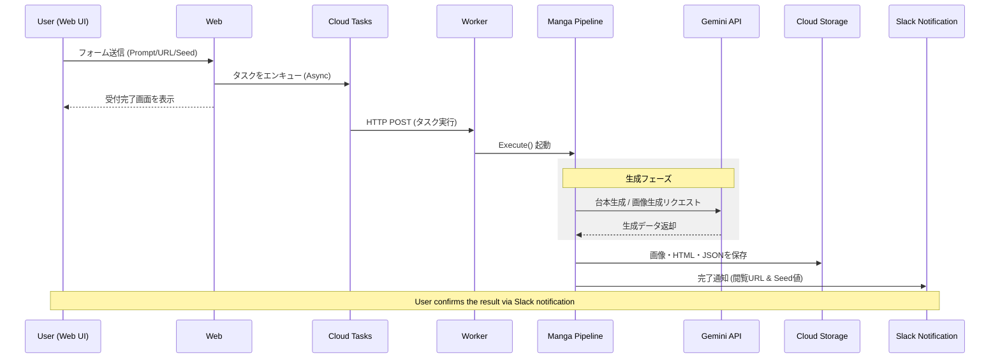

# ✍️ AP Manga Web

[](https://golang.org/)
[](https://golang.org/)
[](https://github.com/shouni/ap-manga-web/tags)
[](https://opensource.org/licenses/MIT)

## 🚀 概要 (About) - Webベースの画像生成オーケストレーター

**AP Manga Web** は、画像生成のコアライブラリ機能を **[Go Manga Kit](https://github.com/shouni/go-manga-kit)** を活用し、その機能を **Cloud Run** および **Google Cloud Tasks** を利用してWebアプリケーション化・オーケストレーションするためのプロジェクトです。

Webフォームを通じて画像生成処理を**非同期ワーカー**（Cloud Tasks）で実行します。処理完了時には **Slack** へ通知が飛び、生成された作品の確認や、キャラクター固定に必要な Seed 値の取得がスムーズに行えるのだ。

---

## 🎨 5つのワークフロー (Workflows)

制作プロセスに応じて、以下の5つの機能をWeb UIから使い分けられるのだ。

| 画面 (Command) | 役割 | 主な入力 / 出力 |
| --- | --- | --- |
| **Design** | DNA抽出。設定画を生成し、**固定用のSeed値を特定**する。 | キャラID / Design Image, **Final Seed** |
| **Generate** | 一括生成。台本解析から全パネルのパブリッシュまで一気通貫。 | URL・プロット / HTML, Images, MD |
| **Script** | 台本生成。URLやテキストからAIが物語構成案（JSON）を生成。 | URL・テキスト / JSON (Script) |
| **Panel** | パネル作画。既存の台本JSONから画像とHTMLを生成。 | 台本JSON / Images |
| **Page** | 生成済みのパネル画像を、Markdown形式に基づきページ単位にレイアウトし、ページ画像を生成 | Images |

---

## ✨ 技術スタック (Technology Stack)

| 要素 | 技術 / ライブラリ | 役割 |
| --- | --- | --- |
| **言語** | **Go (Golang)** | Webサーバー（API/タスクワーカー）の開発言語。 |
| **認証・セッション** | **`x/oauth2`** / **`gorilla/sessions`** | **Google OAuth 2.0** フローとセッション管理。 |
| **Webフレームワーク** | **go-chi/chi/v5** | 軽量なルーティング処理。 |
| **非同期実行** | **Google Cloud Tasks** | 重い画像生成処理をキューイング。 |
| **結果保存** | **Google Cloud Storage (GCS)** | 生成物（HTML/画像）の永続化。 |
| **通知** | **Slack Webhook** | **SlackAdapter** による生成完了および Seed 値の報告。 |

---

## 🏗 システムアーキテクチャ (Internal Structure)

本プロジェクトは、拡張性を高めるために以下の3層構造で設計されています。

1. **Server 層**: Web/Worker ハンドラーが外部との窓口となる。
2. **Pipeline 層**: `MangaPipeline` が全体の指揮官となり、台本・画像生成・公開・Slack通知を制御。内部で個別のタスク実行コンポーネント（Runner）を呼び出す。

---

## 🚀 使い方 (Usage) / セットアップ

### 1. 必要な環境変数

| 環境変数 | 説明 | デフォルト値 |
| --- | --- | --- |
| `SERVICE_URL` | アプリのルートURL（例: `https://myapp.run.app`） | `http://localhost:8080` |
| `GCP_PROJECT_ID` | GCPのプロジェクトID | - |
| `GCP_LOCATION_ID` | GCPのリージョン（Cloud Tasks用） | `asia-northeast1` |
| `CLOUD_TASKS_QUEUE_ID` | 使用する Cloud Tasks のキュー名 | `manga-queue` |
| `SERVICE_ACCOUNT_EMAIL` | タスク発行に使用するサービスアカウント | - |
| `TASK_AUDIENCE_URL` | OIDCトークンの検証用URL | `SERVICE_URL` と同じ |
| `GCS_MANGA_BUCKET` | 画像とHTMLを保存するバケット名 | - |
| `GEMINI_API_KEY` | Google Gemini APIキー | - |
| `GEMINI_MODEL` | 台本構成に使用するモデル名 | `gemini-3-flash-preview` |
| `IMAGE_MODEL` | 画像生成に使用するモデル名 | `gemini-3-pro-image-preview` |
| `GOOGLE_CLIENT_ID` | OAuthクライアントID | - |
| `GOOGLE_CLIENT_SECRET` | OAuthクライアントシークレット | - |
| `SESSION_SECRET` | セッションデータのHMAC署名用シークレット | - |
| `SESSION_ENCRYPT_KEY` | セッションデータのAES暗号化用シークレット | - |
| `ALLOWED_EMAILS` | 許可するメールアドレス（カンマ区切り） | - |
| `ALLOWED_DOMAINS` | 許可するドメイン（例: `example.com`） | - |
| `SLACK_WEBHOOK_URL` | 通知を送る先の Slack Webhook URL | - |

---

## 🔐 必要なIAMロールの設定（重要）

本アプリケーションを Google Cloud Run と Cloud Tasks で安全に運用するためには、各サービスアカウント（SA）に対し、**正確な権限付与**が必要です。設定が不足していると `PermissionDenied (actAs)` や `403 Forbidden` エラーが発生します。

### A. Cloud Run 実行サービスアカウント

*Webフロントエンドおよび非同期ワーカーとして動作する、アプリケーションの主体となるサービスアカウントです。*

| 権限（IAMロール） | 目的 |
| :--- | :--- |
| **Cloud Tasks エンキューア** (`roles/cloudtasks.enqueuer`) | Webフォーム受付時に、タスクを Cloud Tasks キューに**追加**するために必要です。 |
| **サービス アカウント ユーザー** (`roles/iam.serviceAccountUser`) | **最重要:** Cloud Tasks にタスクを託す際、指定した SA として振る舞う（ActAs）ために必要です。**SA自身に対してこの権限を付与**する必要があります。 |
| **サービス アカウント トークン作成者** (`roles/iam.serviceAccountTokenCreator`) | OIDCトークンを生成し、安全なシステム間認証を行うために必要です。 |
| **Cloud Run 起動元** (`roles/run.invoker`) | Cloud Tasks が自分自身（ワーカーエンドポイント）を認証付きで呼び出すことを許可するために必要です。 |
| **Storage オブジェクト管理者** (`roles/storage.objectAdmin`) | 生成された画像やHTMLファイルを **GCS** バケットに保存するために必要です。 |
| **Secret Manager のシークレット アクセサー** (`roles/secretmanager.secretAccessor`) | `GEMINI_API_KEY` や OAuth 情報を Secret Manager から安全に取得するために必要です。 |
| **ログ書き込み** (`roles/logging.logWriter`) | Cloud Logging へ動作ログを出力するために必要です。 |

### B. Cloud Tasks 用の設定（認証の紐付け）

Cloud Tasks がワーカーを呼び出す際に使用する ID（`ServiceAccountEmail`）に関する設定です。

| 項目 | 内容 |
| :--- | :--- |
| **対象エンドポイント** | `/tasks/generate` (POST) |
| **認証方式** | OIDC トークン認証 |
| **Audience** | アプリの `SERVICE_URL`（例: `https://...run.app`） |
| **実行主体** | `SERVICE_ACCOUNT_EMAIL` に設定したサービスアカウント |

---

### ローカルでの実行方法

```bash
# 必要な環境変数を設定（direnv推奨）
export SERVICE_URL="http://localhost:8080"
export GEMINI_API_KEY="your-api-key"
# ...その他の変数

# サーバー起動
go run main.go

```

---

## 🏗 プロジェクトレイアウト (Project Layout)

```text
ap-manga-web/
├── internal/
│   ├── adapters/     # Slack通知等の外部アダプター
│   ├── builder/      # Appコンテキスト、タスク実行コンポーネント(Runner)の構築、サーバー初期化
│   ├── config/       # 環境変数管理、キャラクターDNA定義 (characters.json)
│   ├── domain/       # ドメインモデル (TaskPayload, NotificationRequest)
│   ├── pipeline/     # 全体の指揮官。解析、生成、公開、通知のフロー制御
│   └── server/       # UIハンドラー (Design, Panel, Page等の画面制御)
├── templates/        # Bootstrap 5 を採用したUIテンプレート
└── main.go           # エントリーポイント

```

---

## 💻 ワークフロー (Workflow)

1. **Request**: ユーザーが Web フォームから Markdown プロット等を送信。
2. **Enqueue**: `server.Handler` が `CloudTasksAdapter` を介してジョブを投入。
3. **Worker**: `worker.Handler` がリクエストを受け、`MangaPipeline` を起動。
4. **Pipeline**:
    * **Phase 1: Script/Page**: プロットのパースと物語構成。
    * **Phase 2: Panel/Design**: 画像生成。**特定インデックスの部分生成**にも対応。
    * **Phase 3: Publish**: 生成された成果物をGCSに保存し、一意なURLでアクセス可能にする。
    * **Phase 4: Notification**: Slack への完了報告。**Designモードの場合は Seed 値を明記。**

---

## 🔄 シーケンスフロー (Sequence Flow)



---

## 💡 Tips: キャラクタービジュアルの固定方法

生成されるキャラクターの見た目を一貫させるためには、以下の手順でSeed値を特定・利用します。

1.  **DesignワークフローでSeed値を特定する**: `Design`画面で好みのビジュアルが生成されるまで試行します。
2.  **Slack通知でFinal Seedを確認する**: 処理完了後、Slackに通知される`Final Seed`の値を控えてください。
3.  **他のワークフローでSeed値を利用する**: `Generate`や`Panel`の実行時に、控えたSeed値をフォームに入力すると、同じビジュアルのキャラクターを再現できます。

---

## 🤝 依存関係 (Dependencies)

* [shouni/gcp-kit](https://github.com/shouni/gcp-kit) - GCP上でのWebツールキット
* [shouni/go-remote-io](https://github.com/shouni/go-remote-io) - I/O操作を統一化ライブラリ
* [shouni/go-manga-kit](https://github.com/shouni/go-manga-kit) - 自動ページ分割に対応した作画制作ワークフロー

## 📜 ライセンス (License)

このプロジェクトは [MIT License](https://opensource.org/licenses/MIT) の下で公開されています。

---
