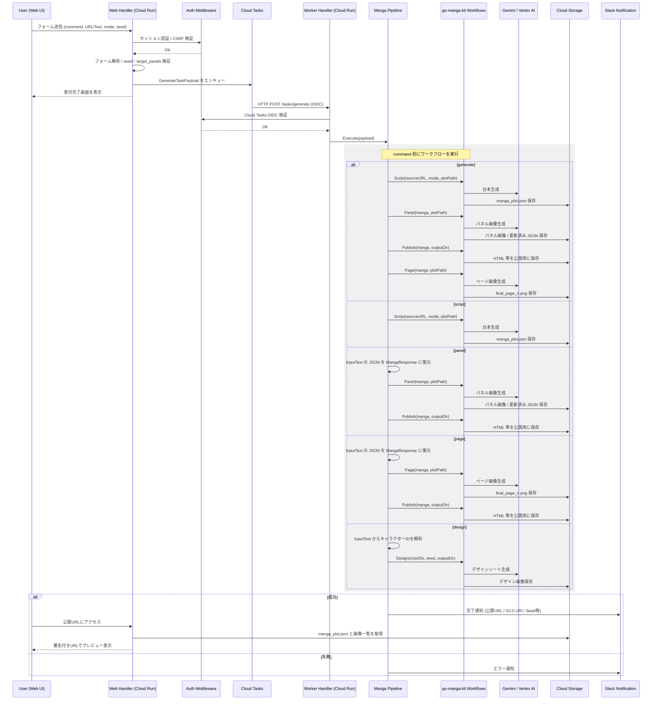

# ✍️ AP Manga Web

[](https://golang.org/)
[](https://golang.org/)
[](https://github.com/shouni/ap-manga-web/tags)
[](https://opensource.org/licenses/MIT)
[](https://goreportcard.com/report/github.com/shouni/ap-manga-web)
[](#)

## 🚀 概要 (About) - Webベースの画像生成オーケストレーター

**AP Manga Web** は、画像生成のコアライブラリ機能を **[Go Manga Kit](https://github.com/shouni/go-manga-kit)** で扱い、**Cloud Run** / **Cloud Tasks** / **Google Cloud Storage** 上で非同期実行する構成を検証するための **PoC / Technical Demonstration** です。

本リポジトリは商用プロダクトではなく、アーキテクチャ、非同期ワークフロー、GCP 連携、生成体験の実装例を公開することを目的としています。Web フォームから受け付けた画像生成処理を Cloud Tasks 経由でワーカーに渡し、処理完了時には **Slack** へ通知します。

## 🎨 5つのワークフロー (Workflows)

制作プロセスの分割を検証するため、以下の5つのワークフローを Web UI から投入できます。

| 画面 (Command) | 役割 | 主な入力 / 出力 |
| --- | --- | --- |
| **Design** | キャラクター ID からデザインシートを生成し、再現用 Seed を返す。 | キャラID / Design Image, Final Seed |
| **Generate** | URL 解析から台本生成、パネル画像、ページ画像、公開用 HTML までを一括実行。 | URL / HTML, Images, JSON |
| **Script** | URL から台本 JSON を生成して保存。 | URL / JSON |
| **Panel** | 既存の台本 JSON からパネル画像を生成し、公開用 HTML を出力。 | 台本JSON / Images, HTML |
| **Page** | 既存の台本 JSON と生成済みパネル画像から、ページ単位の画像を生成。 | 台本JSON / Page Images, HTML |

### 💻 ワークフロー (Workflow)

1. **Request**: ユーザーが Web フォームからプロット等を送信。
2. **Enqueue**: `gcp-kit/tasks.Enqueuer` を介してジョブを非同期投入。
3. **Worker**: `MangaPipeline` が起動。
4. **Pipeline**:
   * **Phase 1: Script**: URL から台本 JSON を生成。
   * **Phase 2: Panel / Page / Design**: Gemini API / Vertex AI による画像生成。
   * **Phase 3: Publish**: HTML、JSON、画像などの成果物を GCS に保存。
   * **Phase 4: Notification**: Slack への完了報告。

---

## 🏗 アーキテクチャ設計 (Architecture)

本プロジェクトは、**ヘキサゴナル・アーキテクチャ**と**サーバーレス・オーケストレーション**を組み合わせた実装例です。

1. **Domain 層 (The Core)**
   * **システムの中心核**です。`Task` や `Notification` など、特定の技術（GCPやWeb）に依存しない純粋なデータ構造とビジネスルールを定義します。すべての層がこの共通言語を通じて連携する、アーキテクチャの真の中心です。
2. **Pipeline 層 (Orchestrator)**
   * **ワークフローの指揮官**としての役割を担います。Domain モデルを使用し、台本生成・画像生成・通知といった一連の処理プロセスを制御します。具体的な保存先や通知手段の詳細は持たず、抽象化されたインターフェース（Port）を介して命令を実行します。
3. **Server 層 (Entry Points)**
   * **外部システムとの窓口**であり、用途に応じて以下の2つの役割を持ちます。
      * **Web Handler**: ユーザーの入力を Domain モデルへ変換し、Cloud Tasks へジョブを投入します。
      * **Worker Handler**: Cloud Tasks からのリクエストを受け取り、Pipeline を起動する実行トリガーとして機能します。
4. **Adapters 層 (Infrastructure)**
   * **実務を担う手足**です。GCS、Slack、Gemini API / Vertex AI、Cloud Tasks といった具体的な外部サービスと接続し、Pipeline からの抽象的な命令を現実の技術的な処理へと翻訳します。
5. **Builder 層 (Dependency Injection)**
   * **システムを組み立てる工場**です。アプリケーションの起動時に「Web用」または「Worker用」に必要な各パーツ（Adapters）を、Domain のルールに従って依存関係を注入しながら結合し、実行可能なシステムとして組み立てます。

---

## 🏗 プロジェクトレイアウト (Project Layout)

```text
ap-manga-web/
├── assets/            # 【資産】静的リソース（Go バイナリに embed で埋め込み）
│   ├── characters/    #   - キャラクター定義 (characters.json)
│   ├── prompts/       #   - AI 指示文テンプレート (prompt_dialogue.md, prompt_duet.md)
│   ├── templates/     #   - Web 表示用 HTML (layout.html, manga_view.html 等)
│   └── assets.go      #   - embed.FS 定義（Prompts / Templates / Characters）
├── internal/
│   ├── adapters/      # 【接続】外部（Gemini API, Slack）との通信を担う実装
│   ├── app/           # 【基盤】Container による依存保持とライフサイクル管理
│   ├── builder/       # 【構築】DI コンテナの組み立てと各コンポーネントの初期化
│   ├── config/        # 【設定】環境変数のロード、定数、バリデーション
│   ├── domain/        # 【中心】ドメインモデル、ポート（インターフェース）定義
│   ├── pipeline/      # 【指揮】Workflow を組み合わせた漫画生成フローの制御
│   ├── prompts/       # 【生成】assets の md と characters.json を用いた AI 指示文の動的構築ロジック
│   └── server/        # 【玄関】ルーティング、各種ハンドラー（submit, view, preview）
└── main.go            # 【起点】アプリのブートストラップ（初期化・起動）

```

---

## 🔄 シーケンスフロー (Sequence Flow)


```mermaid
sequenceDiagram
   participant User as User (Web UI)
   participant Web as Web Handler (Cloud Run)
   participant Auth as Auth Middleware
   participant Queue as Cloud Tasks
   participant Worker as Worker Handler (Cloud Run)
   participant Pipeline as Manga Pipeline
   participant Workflows as go-manga-kit Workflows
   participant AI as Gemini / Vertex AI
   participant GCS as Cloud Storage
   participant Slack as Slack Notification

   User->>Web: フォーム送信 (command, URL/Text, mode, seed)
   Web->>Auth: セッション認証 / CSRF 検証
   Auth-->>Web: OK
   Web->>Web: フォーム解析 / seed・target_panels 検証
   Web->>Queue: GenerateTaskPayload をエンキュー
   Web-->>User: 受付完了画面を表示

   Queue->>Worker: HTTP POST /tasks/generate (OIDC)
   Worker->>Auth: Cloud Tasks OIDC 検証
   Auth-->>Worker: OK
   Worker->>Pipeline: Execute(payload)

   rect rgb(240, 240, 240)
      Note over Pipeline, Workflows: command 別にワークフローを実行

      alt generate
         Pipeline->>Workflows: Script(sourceURL, mode, plotPath)
         Workflows->>AI: 台本生成
         Workflows->>GCS: manga_plot.json 保存
         Pipeline->>Workflows: Panel(manga, plotPath)
         Workflows->>AI: パネル画像生成
         Workflows->>GCS: パネル画像 / 更新済み JSON 保存
         Pipeline->>Workflows: Publish(manga, outputDir)
         Workflows->>GCS: HTML 等を公開用に保存
         Pipeline->>Workflows: Page(manga, plotPath)
         Workflows->>AI: ページ画像生成
         Workflows->>GCS: final_page_n.png 保存
      else script
         Pipeline->>Workflows: Script(sourceURL, mode, plotPath)
         Workflows->>AI: 台本生成
         Workflows->>GCS: manga_plot.json 保存
      else panel
         Pipeline->>Pipeline: InputText の JSON を MangaResponse に復元
         Pipeline->>Workflows: Panel(manga, plotPath)
         Workflows->>AI: パネル画像生成
         Workflows->>GCS: パネル画像 / 更新済み JSON 保存
         Pipeline->>Workflows: Publish(manga, outputDir)
         Workflows->>GCS: HTML 等を公開用に保存
      else page
         Pipeline->>Pipeline: InputText の JSON を MangaResponse に復元
         Pipeline->>Workflows: Page(manga, plotPath)
         Workflows->>AI: ページ画像生成
         Workflows->>GCS: final_page_n.png 保存
         Pipeline->>Workflows: Publish(manga, outputDir)
         Workflows->>GCS: HTML 等を公開用に保存
      else design
         Pipeline->>Pipeline: InputText からキャラクターIDを解析
         Pipeline->>Workflows: Design(charIDs, seed, outputDir)
         Workflows->>AI: デザインシート生成
         Workflows->>GCS: デザイン画像保存
      end
   end

   alt 成功
      Pipeline->>Slack: 完了通知 (公開URL / GCS URI / Seed等)
      User->>Web: 公開URLにアクセス
      Web->>GCS: manga_plot.json と画像一覧を取得
      Web-->>User: 署名付きURLでプレビュー表示
   else 失敗
      Pipeline->>Slack: エラー通知
   end
```

---

## ✨ 技術スタック (Technology Stack)

| 要素 | 技術 / ライブラリ | 役割 |
| --- | --- | --- |
| **言語** | **Go (Golang)** | Webサーバー（API/タスクワーカー）の開発言語。 |
| **認証・セッション** | **`x/oauth2`** / **`gorilla/sessions`** | **Google OAuth 2.0** フローとセッション管理。 |
| **Webフレームワーク** | **go-chi/chi/v5** | 軽量なルーティング処理。 |
| **非同期実行** | **Google Cloud Tasks** | 重い画像生成処理をキューイング。 |
| **AIプラットフォーム** | **Gemini API / Vertex AI** | 台本生成と画像生成。両方を初期化し、片方のみ利用可能な場合はフォールバック。 |
| **結果保存** | **Google Cloud Storage (GCS)** | 生成物（HTML/画像）の永続化。 |
| **通知** | **Slack Webhook** | 生成完了および Seed 値の報告。 |

---

## 🚀 使い方 (Usage) / セットアップ

### 1. HTTP ルート

| ルート | 用途 |
| --- | --- |
| `GET /healthz` | ヘルスチェック |
| `GET /auth/login` / `GET /auth/callback` | Google OAuth 2.0 ログイン |
| `GET /` | Generate 画面 |
| `GET /design` | Design 画面 |
| `GET /script` | Script 画面 |
| `GET /panel` | Panel 画面 |
| `GET /page` | Page 画面 |
| `POST /generate` | Web フォームから Cloud Tasks へジョブを投入 |
| `POST /tasks/generate` | Cloud Tasks から呼び出されるワーカーエンドポイント |
| `GET /{BASE_OUTPUT_DIR}/{title}` | GCS 上の `manga_plot.json` と画像を署名付き URL でプレビュー |

### 2. 必要な環境変数

| 環境変数 | 説明 | デフォルト値 |
| --- | --- | --- |
| `SERVICE_URL` | アプリのルートURL（例: `https://myapp.run.app`） | `http://localhost:8080` |
| `PORT` | HTTPサーバーの待受ポート | `8080` |
| `GCP_PROJECT_ID` | Vertex AI / Cloud Tasks 等で使用するプロジェクトID | - |
| `GCP_LOCATION_ID` | 使用するリージョン（例: `asia-northeast1`） | `asia-northeast1` |
| `CLOUD_TASKS_QUEUE_ID` | 使用する Cloud Tasks のキュー名 | `manga-queue` |
| `SERVICE_ACCOUNT_EMAIL` | タスク発行に使用するサービスアカウント | - |
| `TASK_AUDIENCE_URL` | OIDCトークンの検証用URL | `SERVICE_URL` と同じ |
| `GCS_MANGA_BUCKET` | 画像とHTMLを保存するバケット名 | - |
| `BASE_OUTPUT_DIR` | GCS内の出力ルート。Web UI のプレビューURLにも使用 | `output` |
| `GEMINI_API_KEY` | Gemini API クライアント用 API キー | - |
| `GEMINI_MODEL` | 台本構成に使用するモデル名 | `gemini-3-flash-preview` |
| `IMAGE_MODEL` | 標準画像生成モデル（パネル用） | `gemini-3.1-flash-image-preview` |
| `IMAGE_QUALITY_MODEL` | 高品質画像生成モデル（ページ用） | `gemini-3-pro-image-preview` |
| `GOOGLE_CLIENT_ID` | OAuthクライアントID | - |
| `GOOGLE_CLIENT_SECRET` | OAuthクライアントシークレット | - |
| `SESSION_SECRET` | セッションデータのHMAC署名用シークレット | - |
| `SESSION_ENCRYPT_KEY` | セッションデータのAES暗号化用シークレット | - |
| `ALLOWED_EMAILS` | 許可するメールアドレス（カンマ区切り） | - |
| `ALLOWED_DOMAINS` | 許可するドメイン（例: `example.com`） | - |
| `MAX_PANELS_PER_PAGE` | 1ページあたりの最大パネル数 | `6` |
| `MAX_CONCURRENCY` | 画像生成などの並列実行数 | `2` |
| `RATE_INTERVAL_SEC` | 生成処理のレート制御間隔。秒数または `60s` 形式 | `60s` |
| `SLACK_WEBHOOK_URL` | 通知を送る先の Slack Webhook URL | - |

`cloudbuild.yaml` では Cloud Run デプロイ時に `GCP_PROJECT_ID`、`GCP_LOCATION_ID`、`GEMINI_MODEL`、`IMAGE_MODEL`、`IMAGE_QUALITY_MODEL` を上書きしています。OAuth、セッション、GCS、Slack、Cloud Tasks 関連の値は、Cloud Run の環境変数または Secret Manager 連携で別途設定してください。

---

## 🔐 必要なIAMロールの設定（重要）

本 PoC を Google Cloud Run と Cloud Tasks 上で動かすには、各サービスアカウント（SA）に対し、以下の権限付与が必要です。設定が不足していると `PermissionDenied (actAs)` や `403 Forbidden` エラーが発生します。

### A. Cloud Run 実行サービスアカウント

*Webフロントエンドおよび非同期ワーカーとして動作する、アプリケーションの主体となるサービスアカウントです。*

| 権限（IAMロール） | 目的 |
| :--- | :--- |
| **Cloud Tasks エンキューア** (`roles/cloudtasks.enqueuer`) | Webフォーム受付時に、タスクを Cloud Tasks キューに**追加**するために必要です。 |
| **サービス アカウント ユーザー** (`roles/iam.serviceAccountUser`) | **最重要:** Cloud Tasks にタスクを託す際、指定した SA として振る舞う（ActAs）ために必要です。**SA自身に対してこの権限を付与**する必要があります。 |
| **サービス アカウント トークン作成者** (`roles/iam.serviceAccountTokenCreator`) | OIDCトークンを生成し、安全なシステム間認証を行うために必要です。 |
| **Vertex AI ユーザー** (`roles/aiplatform.user`) | Vertex AI モデル（Gemini/Imagen）を呼び出すために必要です。 |
| **Cloud Run 起動元** (`roles/run.invoker`) | Cloud Tasks が自分自身（ワーカーエンドポイント）を認証付きで呼び出すことを許可するために必要です。 |
| **Storage オブジェクト管理者** (`roles/storage.objectAdmin`) | 生成された画像やHTMLファイルを **GCS** バケットに保存するために必要です。 |
| **Secret Manager のシークレット アクセサー** (`roles/secretmanager.secretAccessor`) | `GEMINI_API_KEY` や OAuth 情報を Secret Manager 経由で渡す場合に必要です。 |
| **ログ書き込み** (`roles/logging.logWriter`) | Cloud Logging へ動作ログを出力するために必要です。 |

### B. Cloud Tasks 用の設定（認証の紐付け）

Cloud Tasks がワーカーを呼び出す際に使用する ID（`ServiceAccountEmail`）に関する設定です。

| 項目 | 内容 |
| :--- | :--- |
| **対象エンドポイント** | `/tasks/generate` (POST) |
| **認証方式** | OIDC トークン認証 |
| **Audience** | アプリの `SERVICE_URL`（例: `https://...run.app`） |
| **実行主体** | `SERVICE_ACCOUNT_EMAIL` に設定したサービスアカウント |

---

### 🤝 依存関係 (Dependencies)

* [shouni/gcp-kit](https://github.com/shouni/gcp-kit) - GCP上でのWebツールキット
* [shouni/go-remote-io](https://github.com/shouni/go-remote-io) - I/O操作を統一化ライブラリ
* [shouni/go-manga-kit](https://github.com/shouni/go-manga-kit) - 自動ページ分割に対応した作画制作ワークフロー

### 📜 ライセンス (License)

* デフォルトキャラクター: VOICEVOX:ずんだもん、VOICEVOX:四国めたん
* このプロジェクトは [MIT License](https://opensource.org/licenses/MIT) の下で公開されています。

---
